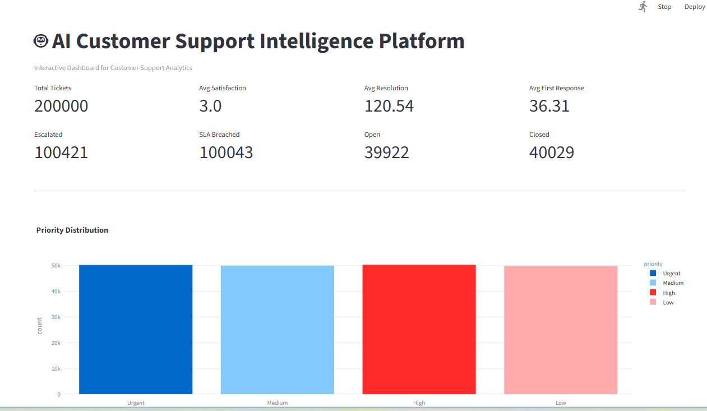
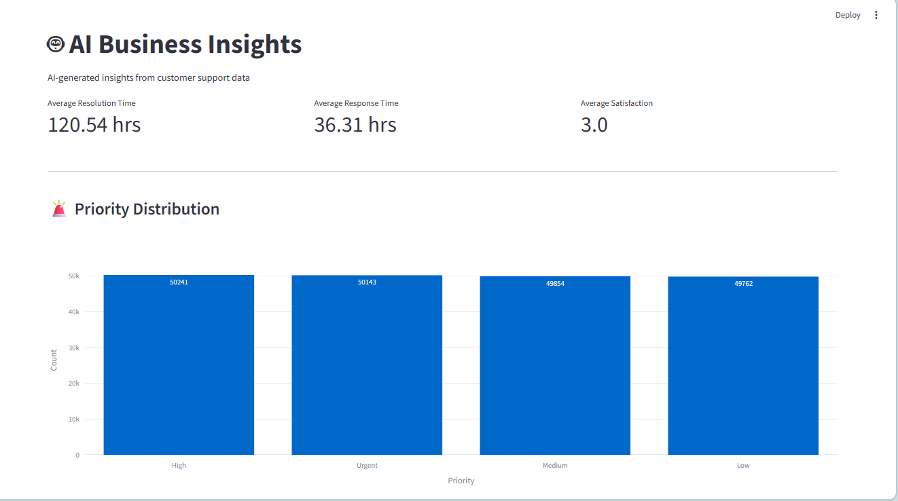
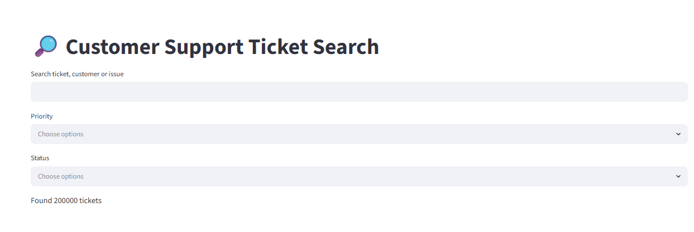

# 🤖 AI Customer Support Analytics Dashboard

An interactive AI-powered analytics dashboard built with **Streamlit**, **Python**, **Machine Learning**, and **Plotly** to analyze customer support ticket data, generate business insights, and predict ticket priority.

---

## 🚀 Features

* 📊 Interactive KPI Dashboard
* 🎯 8 KPI Cards
* 🔍 Ticket Search System
* 🤖 AI Business Insights
* 📈 Monthly Ticket Trend Analysis
* 🌍 Region-wise Ticket Analysis
* 📦 Product-wise Ticket Distribution
* 🏷️ Category-wise Analysis
* ⚡ Priority & Status Analysis
* 😊 Customer Satisfaction Distribution
* 📉 Correlation Heatmap
* 🔥 Response Time vs Resolution Time Analysis
* 🧠 Machine Learning Ticket Priority Prediction
* 📥 CSV Download
* 📋 Interactive Data Table
* 🎛️ Sidebar Filters

---

## 🛠️ Tech Stack

* Python
* Streamlit
* Pandas
* NumPy
* Scikit-learn
* Plotly
* Joblib

---

## 📂 Project Structure

```text
AI-Customer-Support-Analytics/
│
├── dashboard/
│   ├── app.py
│   ├── utils.py
│   └── pages/
│       ├── 1_AI_Insights.py
│       ├── 2_ML_Model.py
│       ├── 3_Search.py
│       └── 4_About.py
│
├── data/
│   ├── raw/
│   └── processed/
│
├── models/
├── src/
├── screenshots/
├── requirements.txt
└── README.md
```

---

## 📸 Screenshots

### Dashboard



### AI Insights



### Search



---

## ⚙️ Installation

Clone the repository:

```bash
git clone https://github.com/aaryamishra77/AI-Customer-Support-Analytics.git
```

Move into the project directory:

```bash
cd AI-Customer-Support-Analytics
```

Install dependencies:

```bash
pip install -r requirements.txt
```

Run the application:

```bash
streamlit run dashboard/app.py
```

---

## 📊 Machine Learning

The project includes a Random Forest Classifier to predict customer support ticket priority using customer and ticket attributes.

---

## 📌 Future Improvements

* LLM-based ticket summarization
* Chatbot integration
* Sentiment Analysis
* Live Database Support
* Real-time Dashboard

---

## 👨‍💻 Author

**Aarya Mishra**

GitHub: https://github.com/aaryamishra77
